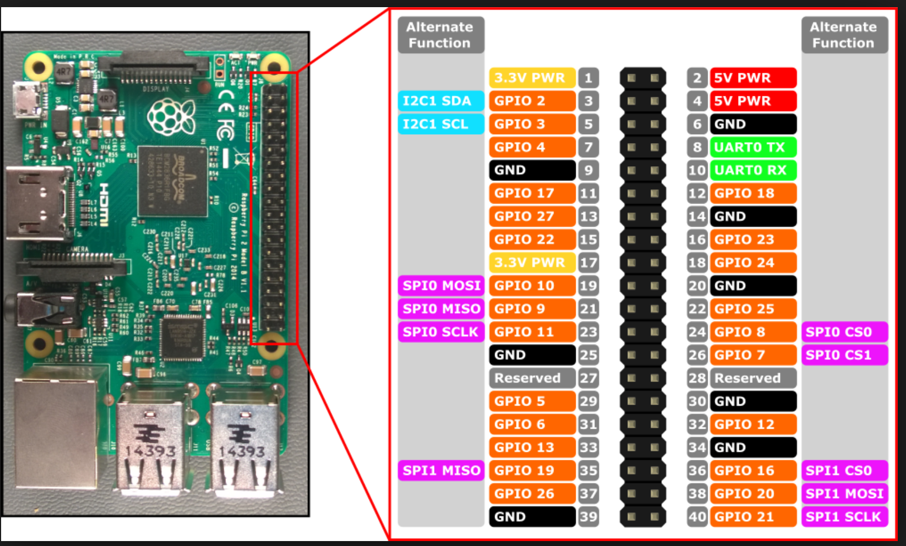

# Surface Computer

In the `ssh_comm` folder of this repository, you can run the `surface_computer.py` script to connect to the robot.

## Python Libary Requirements

### Surface Computer

 - Paramiko
 - TKinter
 - pySerial
 - FuncTools

### Companion Computer

 - PiGPIO
 - pySerial

## Setup

1. Connect the companion to the surface computer via ethernet.
1. Set up the surface computer to have a static IP of `192.168.2.1` (follow the Ardusub Network Setup guide [here](https://www.ardusub.com/getting-started/installation.html#raspberry-pi))
    - Note that the Pi Zero should be connected to the Pi 3 (the companion computer) via USB.
1. Follow ALL the setup instructions for the [temperature sensor](#temperature-sensor) and [pH sensor](#ph-sensor)
1. **Unused until relays added** Connect the Arduino to the surface computer via USB and load the Arduino code in the `pneumatics_arduino` folder onto the arduino via the Arduino IDE.
1. **Unused until relays added** Verify that the COM port used in `surface_computer.py` matches that of the Arduino.  If it does not, update it in `surface_computer.py` script
1. Plug the Arduino Nano that controls the BabyROV thruster into a USB port on the companion computer and make sure it has `babyrov_arduino.ino` onto the Arduino.
1. Everything should be setup at this point, so just run `surface_computer.py` and it should pull up a GUI (note that wherever you run the script from needs to be able to open a GUI so Windows Subsystem For Linux will not work)

## Notes

### Raspberry Pi Pinout for Companion Computer
The following picture shows the Pinout of the Pi

### Temperature sensor

#### Pin setup:
Red connects to 3.3V, Blue connects to ground and Yellow is data (pin 7 which is GPIO04)
4.7 kOhm resistor between data and VCC

For more information, see [this tutorial](http://www.circuitbasics.com/raspberry-pi-ds18b20-temperature-sensor-tutorial/)

Pin Diagram

#### Pi Setup
1. Open `/boot/config.txt` on the companion computer and add `dtoverlay=w1-gpio` to the bottom of the file (if not already there) and reboot the pi
    - Note that the `/boot/config.txt` can be accessed on the boot directory of the SD card instead of logging into the companion computer
1. Copy the `temp_reading.py` script to the companion computer in its home directory

### pH Sensor
This sends setup commands to the ADC when the GUI starts up if an SSH connection was made to the companion computer.  This will put the pH sensor in the proper modes (continuous conversion and data ready mode) so that each reading gets the latest result stored on the ADC.  There will probably be a few seconds (or less - not sure how long) after sending those commands that the pH readings may be garbage / innaccurate.  afterwards, pressing the pH reading key should put the read value into the GUI box.

#### Setup
1. Make sure pigpio is installed on the companion computer
1. Copy the `ph_sensor.py` script to the companion computer in its home directory
    1. Navigate to the `ssh_comm` directory
    1. Execute `scp ph_sensor.py pi@192.168.2.2:~/` to copy it onto the companion computer
        - Note that the Pi needs to be booted up and you need to be able to SSH in

#### Pin Setup

| ADCPin | PI Pin Number | Pi GPIO Number |
|:------:|:-------------:|:--------------:|
| MOSI   | 19            | GPIO 10        |
| MISO   | 21            | GPIO 9         |
| CLK    | 23            | GPIO 11        |
| CS     | 24            | GPIO 8         |
| VCC    | 5V            | 5V             |
| GND    | GND           | GND            |

#### Calibration Instructions

TODO: make a better way to do this that doesn't involve manually editing code

Note that you probably want to wait a little bit after booting up the Pi to make sure the pH sensor has had time to get an accurate reading

1. Get a few solutions with know pH values (should be very accurate for the best results)
1. In the `ssh_comm/ph_sensor.py` file, navigate to the `adc_conversion()` function
1. Change the `LIN_FIT_SLOPE` value to have a value of `1` and `LIN_FIT_INTERCEPT` to have a value of `0`
1. Save the code
1. Navigate to the `ssh_comms` folder in the terminal
1. Copy the code to the companion computer with `scp ph_sensor.py pi@192.168.2.2:~/`
1. SSH into the Pi with `ssh pi@192.168.2.2`
1. Put the pH sensor into one of the sample solutions from step 1
1. Run `python ph_sensor.py` from your SSH session you opened on the Pi and record the value it prints out
1. Repeat the last step 10 times to get a more accurate reading. Average the recorded values and record the new average
1. Repeat the last 3 steps for each sample solution recording all the averages
1. Create a line of best fit using the average values recorded for the X values and pH values of the sample solutions for the Y values. (make sure you match each solution up with its corresponding reading 1 to 1)
1. Edit the `ph_sensor.py` file on you computer again
1. Navigate to the `adc_conversion()` function
1. Change the `LIN_FIT_SLOPE` value to the slope of the line of best fit you calculated and `LIN_FIT_INTERCEPT` to the y-intercept of the line of best fit you calculated
1. Save the file. Commit your changes to Git (make sure you make a new branch if you're not on your own already)
1. Navigate to the `ssh_comms` folder in the terminal
1. Copy the code to the companion computer with `scp ph_sensor.py pi@192.168.2.2:~/`

Running `ph_sensor.py` on the Pi should give you an accurate pH reading now

### Winch and BabyROV Thruster
This section describes how to setup and control the BabyROV using the winch to reel and unreel it along with the thruster on the BabyROV.

#### Setup

1. Navigate to the `ssh_comm` folder in your terminal.
1. Power on the companion computer
1. Once the Pi is all booted up and you can ssh into it, execute `scp babyrov_control.py pi@192.168.2.2:~/`
    - This will copy the control script over to the Pi
1. Load the `babyrov_arduino.ino` file onto the BabyROV Arduino Nano via the Arduino IDE (or using whatever driver is necessary - I think Peter knew what this was)
1. Run `ssh_comm/surface_computer.py` in windows command prompt (WSL does not work since this uses TKinter).
    - If you run into any issues connecting to the Pi, follow the instructions in [Surface Computer](./Surface_Computer.md)
1. The GUI should now have three new text box rows
    1. Thruster Speed
    1. Winch Forward Speed
    1. Winch Backward Speed
1. The editable boxes on the right side of the rows are where you should put the values you want to use to move the BabyROV/winch
    - The values should all be in the range [0,255]
1. Pressing `w` and `s` will move the BabyROV/Winch forward and backward (respectively)

#### Pin Setup

| ADCPin | PI Pin Number | Pi GPIO Number |
|:------:|:-------------:|:--------------:|
| ENABLE | 32            | GPIO 12        |
| INPUT1 | 16            | GPIO 23        |
| INPUT2 | 18            | GPIO 24        |
| VCC    | 5V            | 5V             |
| GND    | GND           | GND            |
